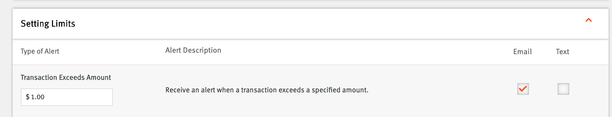
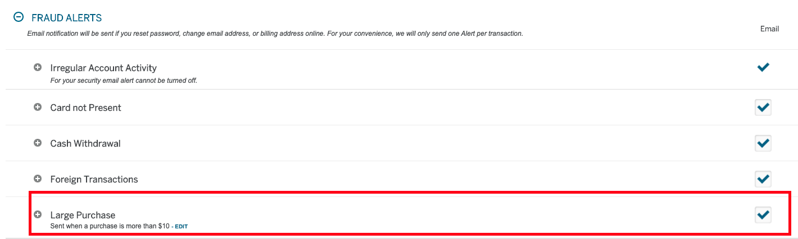

# YNAB Live
## Credit Card Email Notifications to YNAB API Automator

## Features:
- [X] Automatically parse credit card spending alerts for import into YNAB via API
- [X] Currently Supports Credit Card Outflows on Cards:
  - [X] Discover - Transactions over $1
  - [X] American - Transactions over $10 (This is the lowest amount you can be alerted via email on and is set by Amex)
  - [X] Chase - Transactions over $0.01

## Roadmap:
- [ ] Support for additional transaction types ex: Credit Card Inflows
- [ ] Support for additional credit cards
- [ ] Support for banks (checking/saving accounts)

## Installation
1.  Copy the source files to a web server with PHP support
  * It is recommended to run this on a web server that is not publicly facing or hide the files from public view

### Configure
1. Update configuration variables in index.php located under "//CONFIGURE ME"

  ```
  $hostname = '{imap.gmail.com:993/debug/imap/ssl}Inbox'; //IMAP Hostname - Prepopulated for GMAIL
  $username = 'Username'; //IMAP Username
  $password = 'Password'; //IMAP Password
  $ynabAccessToken = ""; //YNAB Developer Access Token - This can be obtained from Ynab --> Account Settings --> Developer Settings --> Personal Access Tokens
  ```

2. Setup web server to execute the script on a set interval, example below using crontab:
  ```
  */30 * * * * /usr/bin/php /var/www/path to files/index.php >/dev/null 2>&1 #This will run every 30 minutes
  ```
3. The script has a safeguard to only allow execution from localhost.  If you plan to run manually or from another IP: Uncomment line 18 of index.php and update as needed.

  ```
  if (isset($_SERVER['REMOTE_ADDR'])) {
    //if ($_SERVER['REMOTE_ADDR'] != "") {
      die("Unauthorized");
    //}
  }
  ```

4. Enable email alerts from the credit card provider(s) being used:
  * Discover: Manager --> Account Alerts --> Setting Limits
  

  * Amex: Manage Account Alerts --> Fraud Alerts --> Large Purchase
  

  * Chase: Profile and Settings --> Alerts --> Choose Alerts
  

## License
- YNAB Live is available under the MIT license.  See the `LICENSE` file for more info.

## Shoutouts / Inspiration
- https://github.com/buzzlawless/ynab-live-import
- https://github.com/ashleyhindle/monzo-to-ynab
